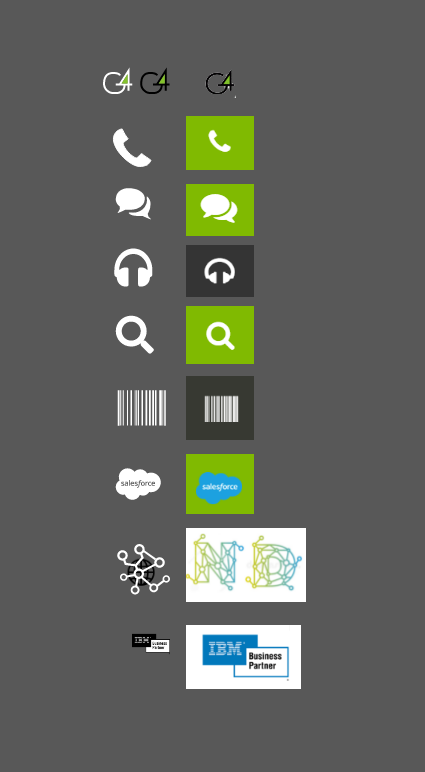

# G4Flex

  <a href="#-tecnologias">Tecnologias</a>&nbsp;&nbsp;&nbsp;|&nbsp;&nbsp;&nbsp;
  <a href="#-projeto">Projeto</a>&nbsp;&nbsp;&nbsp;|&nbsp;&nbsp;&nbsp;
  <a href="#-License">Licença</a>&nbsp;&nbsp;&nbsp;

 

## 🧪 Tecnologias

Esse projeto foi desenvolvido com as seguintes tecnologias: 

- [HTML5]
- [CSS3]
- [JavaScript]

## 💻 Projeto

O projeto foi desenvolvido com o intuito de de recriar o site da Empresa [G4Flex](http://www.g4flex.com.br/) em um determinado período de tempo.

Meu objetivo era recriar todas as funcionalidades básicas do site original, concertando alguns aspectos relacionado a responsividade entre outros detalhes visuais.

Todas as imagens de fundo foram tiradas do site [undraw](https://undraw.co/), com licenças gratuitas tanto pessoal como comercialmente.

As demais imagens foram tiradas do site da própria empresa.

### Acesso

O site pode ser acessado [aqui!](https://marllon-freitas.github.io/G4Flex/).

### Implementações

- Foi implementado um tema escuro para o site;
- Um botão que retorna ao topo da página;
- Responsividade aprimorada;
- Recriação dos ícones:
  Todos os ícones do site foram refeitos por mim, utilizando o software [adobeXD](https://www.adobe.com/br/products/xd.html).
  

### Problemas

Devido ao tempo as seguintes páginas não foram recriadas:

- [Community](http://www.g4flex.com.br/community/index.html);
- [Eventos](http://www.g4flex.com.br/eventos/index.html);
- [G4Flex Academy](http://www.g4flex.com.br/academy/index.html).

## 📝 License

Esse projeto está sob a licença MIT.

---
